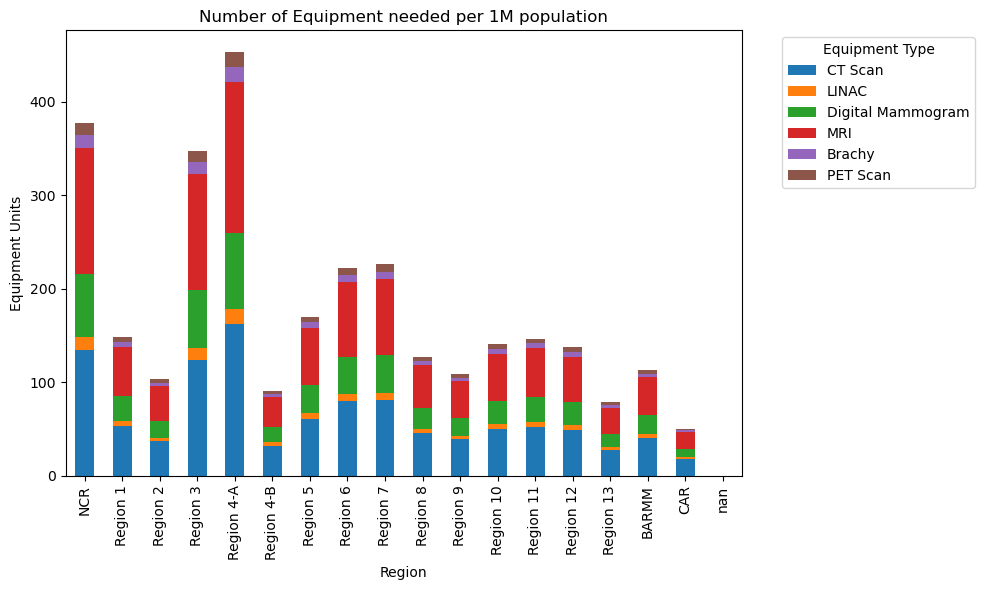
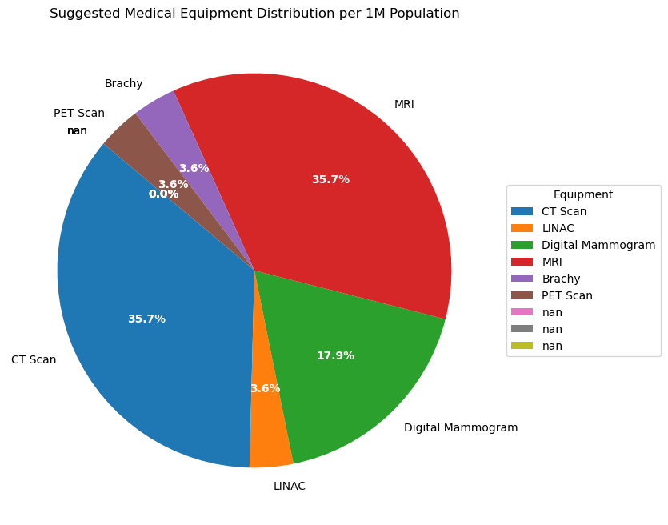
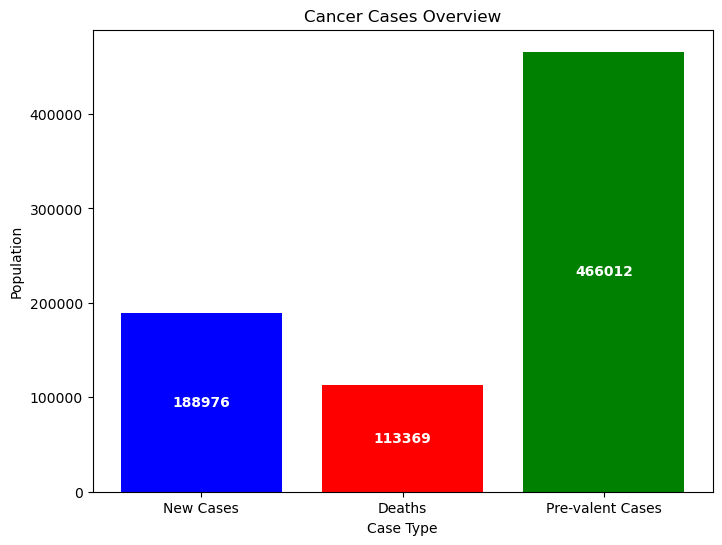
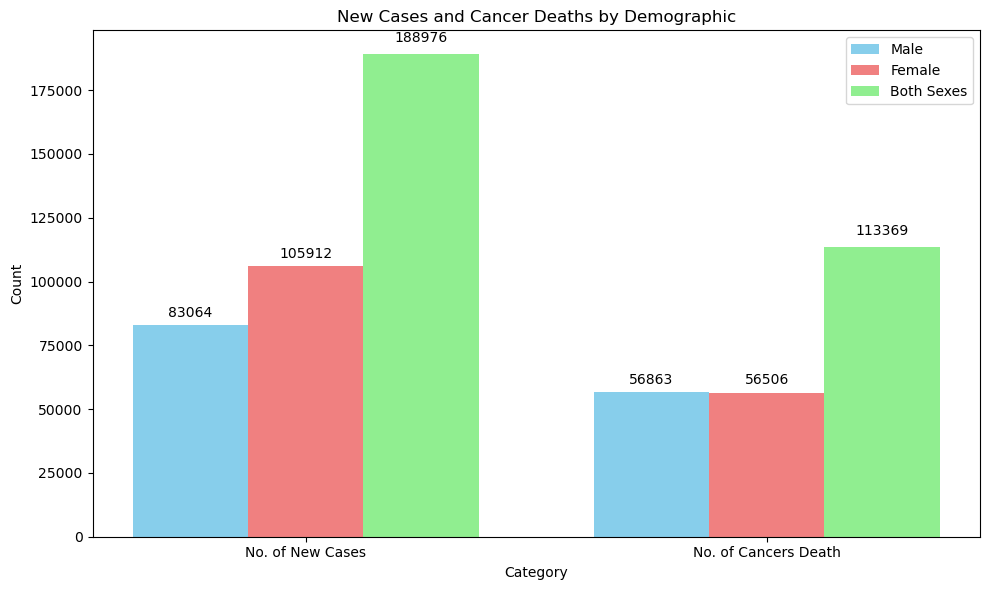
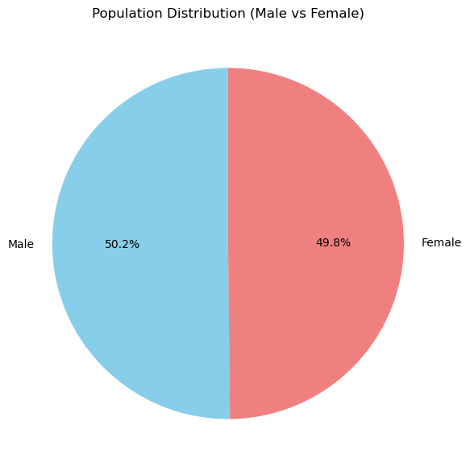

# Analysis of 25 designated cancer centers as mandated by the DOH

The goal is to create a visualization using these list:

1. Number of equipment needed per 1M population
2. Suggested number per 1M population
3. Philippine Cancer Cases of 2022
4. Population of Cancer Patients

## Install libraries using pip

Follow this step:


```python
pip install pandas matplotlib
```

    The history saving thread hit an unexpected error (OperationalError('attempt to write a readonly database')).History will not be written to the database.
    Defaulting to user installation because normal site-packages is not writeable


## Import all libraries needed

These are the dependencies:
1. pandas
2. matplotlib


```python
import pandas as pd
import matplotlib.pyplot as plt
```

## 1. Number of equipment needed per 1M population


```python
# Load data from CSV
df = pd.read_csv("cancer_cases(noEquipmentNeeded).csv")

# Set 'Region (as of 2022)' as the index to use region names for the x-axis
df.set_index("Region\n(as of 2022)", inplace=True)

# Select only equipment columns for the stacked bar plot
equipment_columns = ["CT Scan", "LINAC", "Digital Mammogram", "MRI", "Brachy", "PET Scan"]

# Plotting the stacked bar chart
df[equipment_columns].plot(kind="bar", stacked=True, figsize=(10, 6))

# Adding labels and title
plt.xlabel("Region")
plt.ylabel("Equipment Units")
plt.title("Number of Equipment needed per 1M population")
plt.legend(title="Equipment Type", bbox_to_anchor=(1.05, 1), loc='upper left')
plt.tight_layout()

# Show the plot
plt.show()
```


    

    


## 2. Suggested number per 1M population


```python
# Load the data from the CSV file
df = pd.read_csv('cancer_cases(suggestedEquipment).csv')

# Handle NaN values: Fill NaN with 0 (or drop rows if necessary)
df['Suggested # per 1M population'].fillna(0, inplace=True)  # Or use df.dropna(subset=['Suggested # per 1M population'], inplace=True)

# Ensure the column is numeric, converting any non-numeric values to NaN
df['Suggested # per 1M population'] = pd.to_numeric(df['Suggested # per 1M population'], errors='coerce')

# Plotting the pie chart
plt.figure(figsize=(8, 8))
wedges, texts, autotexts = plt.pie(df['Suggested # per 1M population'], labels=df['EQUIPMENT'], autopct='%1.1f%%', startangle=140)

# Customizing the labels inside the pie chart
for autotext in autotexts:
    autotext.set_color('white')  # Set the text color to white
    autotext.set_fontweight('bold')  # Make the font bold for better visibility

# Adding legend on the right
plt.legend(df['EQUIPMENT'], title="Equipment", loc="center left", bbox_to_anchor=(1, 0, 0.5, 1))
plt.title("Suggested Medical Equipment Distribution per 1M Population")

# Show the plot
plt.show()
```


    

    


## 3. Philippine Cancer Cases of 2022


```python
# Load the data from the CSV file
df = pd.read_csv('cancer_cases(cancerCases).csv')

# Drop the extra column if there are 3 columns and rename the remaining columns
df = df.iloc[:, :2]  # Select only the first two columns (Case Type and Count)
df.columns = ['Case Type', 'Population']  # Rename the columns

# Plotting the bar chart
plt.figure(figsize=(8, 6))
bars = plt.bar(df['Case Type'], df['Population'], color=['blue', 'red', 'green'])

# Adding labels inside the bars
for bar in bars:
    yval = bar.get_height()
    # Placing the label in the center of the bar
    plt.text(bar.get_x() + bar.get_width()/2, yval/2,  # Adjust position to the center
             f'{yval}', ha='center', va='center', color='white', fontweight='bold')

# Adding title and labels
plt.title('Cancer Cases Overview')
plt.xlabel('Case Type')
plt.ylabel('Population')

# Show the plot
plt.show()
```


    

    


## 4. Population of Cancer Patients


```python
import pandas as pd
import matplotlib.pyplot as plt

# Data
data = {
    'Category': ['No. of New Cases', 'No. of Cancers Death'],
    'Male': [83064, 56863],
    'Female': [105912, 56506],
    'Both Sexes': [188976, 113369]
}

# Population data for pie chart
population = {
    'Male': 56449792,
    'Female': 56059199
}

# Create DataFrame for the bar chart
df = pd.DataFrame(data)

# Set up the bar chart
fig, ax = plt.subplots(figsize=(10, 6))

# Set bar width and position
bar_width = 0.25
positions = range(len(df['Category']))

# Plotting each demographic in the bar chart
ax.bar([p - bar_width for p in positions], df['Male'], width=bar_width, label='Male', color='skyblue')
ax.bar(positions, df['Female'], width=bar_width, label='Female', color='lightcoral')
ax.bar([p + bar_width for p in positions], df['Both Sexes'], width=bar_width, label='Both Sexes', color='lightgreen')

# Labeling the bar chart
ax.set_xlabel("Category")
ax.set_ylabel("Count")
ax.set_title("New Cases and Cancer Deaths by Demographic")

# Adding x-ticks for the bar chart
ax.set_xticks(positions)
ax.set_xticklabels(df['Category'])

# Adding the values above the bars
for i in range(len(df['Category'])):
    ax.text(i - bar_width, df['Male'][i] + 0.02 * max(df['Male']), str(df['Male'][i]), ha='center', va='bottom')
    ax.text(i, df['Female'][i] + 0.02 * max(df['Female']), str(df['Female'][i]), ha='center', va='bottom')
    ax.text(i + bar_width, df['Both Sexes'][i] + 0.02 * max(df['Both Sexes']), str(df['Both Sexes'][i]), ha='center', va='bottom')

# Adding legend to the bar chart
ax.legend()

# Display the bar chart
plt.tight_layout()

# Create a second subplot for the pie chart
fig2, ax2 = plt.subplots(figsize=(6, 6))

# Pie chart for Population
ax2.pie(population.values(), labels=population.keys(), autopct='%1.1f%%', startangle=90, colors=['skyblue', 'lightcoral'])
ax2.set_title('Population Distribution (Male vs Female)')

# Display the pie chart
plt.tight_layout()

# Show both charts
plt.show()

```


    

    


    

    


## Findings


1. ### Number of equipment needed per 1M population.
- The results shows that regions with higher populations, such as NCR (National Capital Region) with 13.48 million people and Region 4-A (CALABARZON) with 16.2 million people, show proportionally higher counts of medical imaging equipment (CT Scans, LINAC, MRI, Digital Mammograms, etc.).
- Regions such as Region 3 (Central Luzon), Region 6 (Western Visayas), and Region 7 (Central Visayas) have moderate populations (5-12 million) and display relatively proportional levels of equipment. For instance, Region 7 has 80.8 CT Scans and MRI units each, reflecting its population size.
- Regions with lower populations, such as CAR (Cordillera Administrative Region) and Region 13 (CARAGA), exhibit significantly fewer resources, with 18-28 units for each equipment type. This disparity points to potential challenges in access to healthcare technology for residents in these areas.
  
2. ### Suggested number per 1M population
- CT Scanners: Suggested at 10 units per 1 million population. This reflects the need for widely available CT services, which are commonly used for diagnostic imaging in multiple medical conditions.
- Linear Accelerators (LINAC): Suggested at 1 unit per 1 million population. LINACs are used primarily in radiation therapy for cancer patients, indicating a specialized yet less frequently needed service compared to diagnostic equipment.
- Digital Mammograms: Suggested at 5 units per 1 million population. This recommendation reflects the necessity for screening tools in preventive care, especially in breast cancer detection.
- MRI Machines: Suggested at 10 units per 1 million population. This number aligns with the high demand for MRI in diagnostics, similar to CT scans, due to its extensive applications across various medical conditions.
- Brachytherapy Units (Brachy): Suggested at 1 unit per 1 million population. Brachytherapy, used for localized cancer treatments, is a specialized service, hence the low recommended count.
- PET Scanners: Suggested at 1 unit per 1 million population. PET scans are generally used in oncology and neurology, reflecting the need for specific but essential diagnostic capabilities for complex conditions.

3. ### Philippine Cancer Cases of 2022
- New Cases: There are 188,976 new cases reported within the population. This figure highlights the current incidence rate of the condition and suggests a high need for timely diagnosis and early intervention to manage new cases effectively.
- Deaths: With 113,369 deaths recorded, this number indicates a significant mortality rate, suggesting that the condition has severe impacts on the population’s health. This may underscore the need for enhanced preventive measures, early treatment, and potentially more resources for palliative and end-of-life care.
- Prevalent Cases: The number of 466,012 prevalent cases suggests a large population of individuals living with the condition, either

4. ### Population of Cancer Patients
- The population is nearly balanced between males and females, with only a slight difference of approximately 390,593 more males than females. The total population across both sexes is 112,508,991.
- There were a total of 188,976 new cancer cases reported, with females accounting for a higher number of new cases (105,912) compared to males (83,064).Females have about 22,848 more new cases than males, indicating a higher incidence rate in females.
- Cancer deaths are almost equally distributed between males (56,863) and females (56,506), with only a slight difference of 357 more deaths in males. The total number of cancer-related deaths across both sexes is 113,369, which is about 60% of the new cases reported, suggesting a significant mortality impact from cancer.\
- The mortality rate, calculated as deaths relative to new cases, is slightly higher in males (approximately 68.5%) than in females (around 53.4%). This suggests that males with cancer might have a slightly higher risk of death compared to females.

